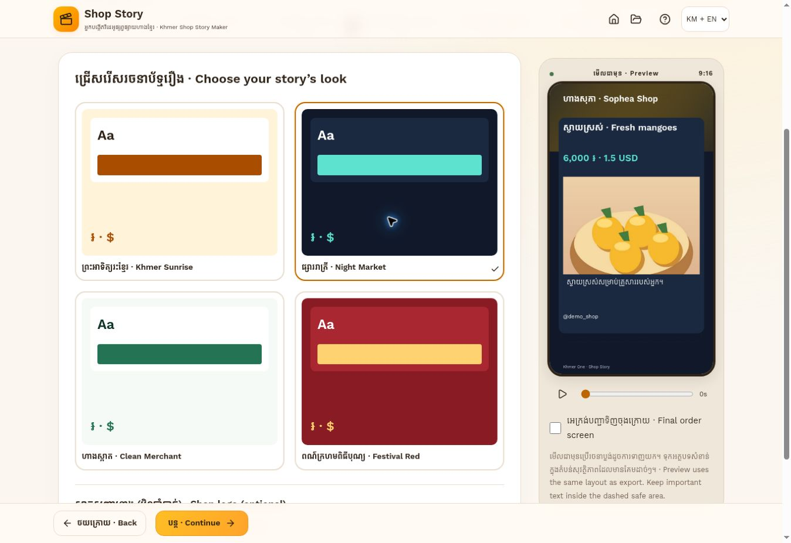

# Khmer Shop Story Maker

**អ្នកបង្កើតវីដេអូផ្សព្វផ្សាយហាងខ្មែរ** · **Shop Story**

A Khmer-first, local-first promotional story editor for Cambodian merchants.
Upload product photos, enter exact prices and contacts, add your own narration,
and export a vertical story without an account or AI credentials.



Preview uses synthetic demonstration artwork and contact details, not a real merchant.

## Features

- Seven-step mobile wizard, with persistent Khmer / English / bilingual UI.
- One to five photos; camera chooser, reorder, replace, local resize/compression
  and adjustable crop position/zoom.
- Shop/product details, independently entered riel and dollar amounts, contacts,
  location, tagline and ordering instructions.
- Editable Khmer and English copy. Deterministic fact-preserving templates;
  optional isolated AI fact ordering and transcription provider interfaces.
- Four visual palettes: Khmer Sunrise, Night Market, Clean Merchant, Festival Red.
- Optional logo and merchant KHQR, displayed without cropping or payment claims.
- Own 20-second narration, editable transcript and seekable caption timing.
- Animated 9:16 preview, 10–20 second video, 720p default / optional 1080p,
  PNG story/order images, download and progressive Web Share support.
- Automatic IndexedDB drafts, project history, deletion confirmation, offline
  shell/fonts/export adapter and a visible return link to Khmer One.
- Privacy panel, no tracking, no cloud uploads by default, disabled premium flags.

## Setup

Node **22.12+** and npm. This is a Vite application, not a Next.js server.

```sh
npm ci
cp .env.example .env
npm run dev
```

Open the localhost address from Vite. Localhost permits microphone and service
worker testing; a phone on an ordinary HTTP LAN address does not. Use HTTPS for
phone testing. `npm run dev` does not register the production service worker.

## Commands

```sh
npm run typecheck
npm run lint
npm test
npm run build
npm run preview
```

`npm run build` type-checks, creates `dist/`, then generates the hashed offline
shell service worker. GitHub Actions runs type checking, lint, unit/component
and storage tests, then the production build and uploads its static artifact.
See [verification](docs/VERIFICATION.md) for tested paths and device boundaries.

## Environment variables

| Variable                       | Purpose                                       | Default                  |
| ------------------------------ | --------------------------------------------- | ------------------------ |
| `VITE_APP_URL`                 | Actual deployed URL in the portal metadata    | unset/null               |
| `VITE_KHMER_ONE_PORTAL_URL`    | Visible portal return link                    | Khmer One Cloudflare URL |
| `VITE_AI_PROXY_URL`            | Optional secure text-only fact-ordering proxy | disabled                 |
| `VITE_TRANSCRIPTION_PROXY_URL` | Optional secure voice transcription proxy     | disabled                 |

These values are public build configuration, **not secrets**. No AI key,
Cloudflare token, R2 credential or payment credential belongs in them. Variables
for unused integrations are intentionally not included. Core editing/export
works with the example file unchanged. The default CSP restricts requests to
same origin; enabling external proxies requires allowing their exact origins.

## Architecture and providers

Reusable UI is in `src/components`, locales in `src/locales`, palettes and portal
metadata in `src/data`, storage/image/model utilities in `src/lib`, providers in
`src/providers`, shared composition/export in `src/render`.

See [architecture](docs/ARCHITECTURE.md), [video spike](docs/EXPORT_SPIKE.md),
[provider contracts](docs/PROVIDERS.md), and [Cloudflare deployment](docs/DEPLOYMENT.md).

## Privacy and offline behavior

Media is stored as local Blobs in this browser's IndexedDB. Uploading a photo in
the editor does **not** upload it to a server. Public preview sharing is disabled.
Local PNG/video files are only sent elsewhere when the merchant shares them.
Optional AI/transcription sends chosen text/audio only after explicit consent;
provider retention applies. Photos/KHQR never go to these providers in this MVP.

The shell, font files and lazy export chunk are precached under an app-specific
cache prefix. Previously saved projects reopen offline after a complete online
installation. Cache updates do not erase IndexedDB. Private browsing, browser
quota eviction or clearing site data can delete drafts. Download important
exports. Deleting a project removes its stored media; exported downloads remain
in the user's device file system until the user removes them.

## KHQR and monetization

An uploaded KHQR is only a visual merchant payment option. The application does
not process, verify or confirm payments. Buyers must check the recipient name
in their banking app, and merchants should scan-test the exported image. Banking
credentials and transaction details are not collected.

Free exports contain a Khmer One mark. Watermark-free exports, template packs
and public links remain disabled. A future PaymentVerifier adapter must verify
a legitimate payment or owner-approved transaction before issuing credits; an
uploaded screenshot cannot unlock paid features.

## Known MVP limitations

- Video formats depend on actual browser codecs/resources. MP4 is preferred;
  WebM is offered where MP4 is unavailable. Some social apps need conversion.
  PNG always remains available. Rendering takes the video duration in real time.
- Caption cues are distributed evenly, not synchronized by speech alignment.
- Local copy does not translate words. Bilingual output requires reviewing and
  editing each language. AI is restricted to fact order rather than free-form
  creative translation; medical/discount/contact claims are never invented.
- No music library, automatic voice synthesis, account, cloud backup, public
  preview link, payment processing or remote-upload deletion UI.
- Photos are compressed before saving, so original full-resolution files are
  not retained. Very large/HEIC files must be converted or reduced beforehand.
- Long text is fitted and may be visibly ellipsized. Review every preview.
- Physical low-end Android and iPhone/social-app import QA remains a release
  requirement; do not infer hardware certification from desktop tests.

## Portal integration

Set `VITE_APP_URL` only to a verified deployment URL. The prepared adapter in
`integration/khmerone-registry.ts` matches the existing Khmer One registry. It
supports a null URL while awaiting deployment. No existing portal component was
modified by this standalone project. See DEPLOYMENT.md for the exact integration.

## Roadmap

Native Khmer copy review, better manual caption timing, additional merchant
layouts, optional secure AI/transcription, authenticated expiring previews,
verified KHQR export credits, premium packs and device performance telemetry
only with explicit opt-in.

## License

MIT for source. Self-hosted Kantumruy Pro is SIL OFL; see `public/fonts/OFL.txt`.
Merchant uploads remain their owners' material.
